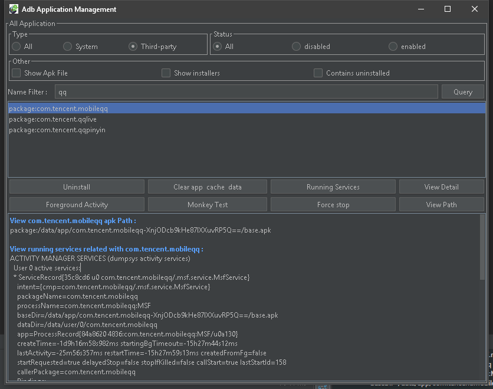
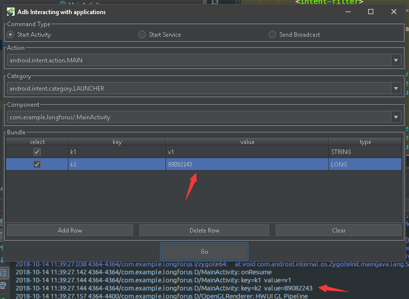
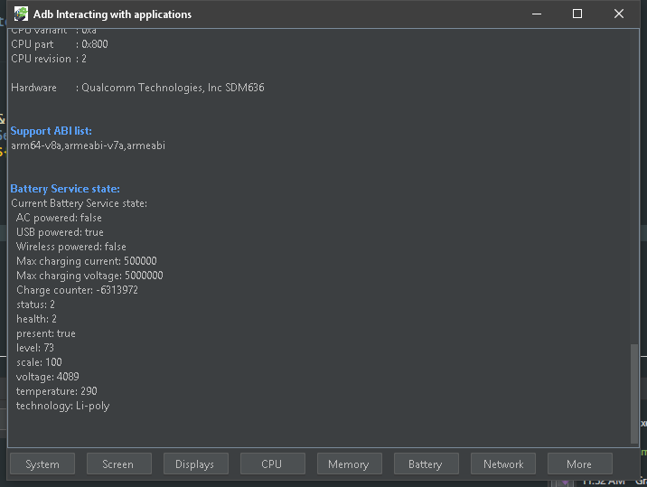
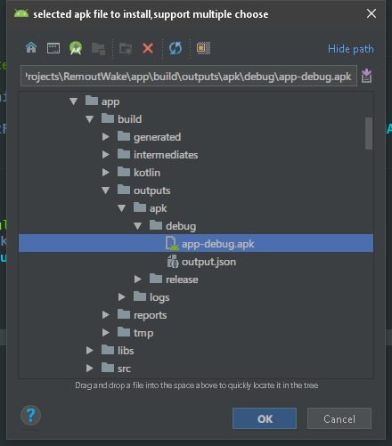
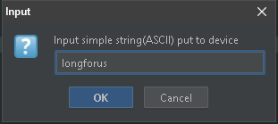
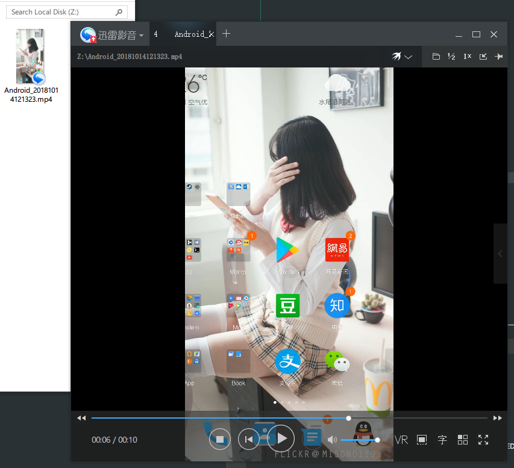

## 起源

  前段时间鸿洋推送的一篇[《推荐3个有用的开源项目》](https://mp.weixin.qq.com/s?__biz=MzAxMTI4MTkwNQ==&mid=2650826138&idx=1&sn=eeaed05fbd58a71fead6ea8b2d245ff9&chksm=80b7b104b7c03812e8876897c1d1ae2ee9c349674667dac660520815277fdf4021750cfa1cb2&mpshare=1&scene=23&srcid=1014SmKcBFEpROGevZvWA5HR#rd)文章中,推荐了一篇github上的[ADB 用法大全](https://github.com/mzlogin/awesome-adb) ,非常的全面,正如大全中提到的: "ADB，即 [Android Debug Bridge](https://developer.android.com/studio/command-line/adb.html)，它是 Android 开发/测试人员不可替代的强大工具，也是 Android 设备玩家的好玩具."相信做安卓开发的肯定都会用到.它的功能是非常强大的.但是强大一般也意味着复杂.我除了少数经常使用到的命令外,其他的都不甚了解.使用上也不是非常的方便,比如安装一个apk文件到手机,我一般是先打开这个apk所在的目录,右键Git Bash Here,然后键入:`adb install -r ./apkFile.apk`,虽然很有逼格,但是有没有更方便一点的实现方式呢?鸿洋的文章中也说道了一个现有的ADB整合插件[adb-idea](https://github.com/pbreault/adb-idea),这个插件我一直都有在用,特别是调试的时候.举个栗子:假如想在启动流程的代码中添加添加一个断点,(比如App启动的第一个Activity的onCreate()中),以前只能打了断点之后点击Debug 'app'按钮,重新走一遍编译流程才能进入断点.可是有时候是什么代码都没有改的.这一个编译流程完全没有必要.但是有了这个插件以后.只需要打好断点.Ctrl+Alt+Shift+A,选择ADB Restart App With Debugger,就可以跳过编译流程,直接启动进入断点了,非常的方便.鸿洋的文章中也提到希望有人能结合这2个优秀的项目做一个较为完备的提示插件.最近项目也比较轻松,私活也接不到,闲得时候都在鼓捣一些开发的辅助工具.正好我在插件這方面有一点点经验,站在巨人的肩膀上这种事我是喜欢干的.我fork[adb-idea](https://github.com/pbreault/adb-idea)这个项目参照[ADB 用法大全](https://github.com/mzlogin/awesome-adb),经过断断续续的开发,在原有的功能上做了一些画蛇添足的扩展,做出来一看感觉和"提示插件"搭不上太大的关系,算是辅助插件吧.不尽完美,好歹还有点作用,现在推荐给大家,对使用姿势做一个简单的说明.

## 特性和使用

### 扩展功能

#### 应用管理

- 查看应用列表
  - [所有应用](https://github.com/mzlogin/awesome-adb#%E6%89%80%E6%9C%89%E5%BA%94%E7%94%A8)
  - [系统应用](https://github.com/mzlogin/awesome-adb#%E7%B3%BB%E7%BB%9F%E5%BA%94%E7%94%A8)
  - [第三方应用](https://github.com/mzlogin/awesome-adb#%E7%AC%AC%E4%B8%89%E6%96%B9%E5%BA%94%E7%94%A8)
  - [包名包含某字符串的应用](https://github.com/mzlogin/awesome-adb#%E5%8C%85%E5%90%8D%E5%8C%85%E5%90%AB%E6%9F%90%E5%AD%97%E7%AC%A6%E4%B8%B2%E7%9A%84%E5%BA%94%E7%94%A8)
- [卸载应用](https://github.com/mzlogin/awesome-adb#%E5%8D%B8%E8%BD%BD%E5%BA%94%E7%94%A8)
- [清除应用数据与缓存](https://github.com/mzlogin/awesome-adb#%E6%B8%85%E9%99%A4%E5%BA%94%E7%94%A8%E6%95%B0%E6%8D%AE%E4%B8%8E%E7%BC%93%E5%AD%98)
- [查看前台 Activity](https://github.com/mzlogin/awesome-adb#%E6%9F%A5%E7%9C%8B%E5%89%8D%E5%8F%B0-activity)
- [查看正在运行的 Services](https://github.com/mzlogin/awesome-adb#%E6%9F%A5%E7%9C%8B%E6%AD%A3%E5%9C%A8%E8%BF%90%E8%A1%8C%E7%9A%84-services)
- [查看应用详细信息](https://github.com/mzlogin/awesome-adb#%E6%9F%A5%E7%9C%8B%E5%BA%94%E7%94%A8%E8%AF%A6%E7%BB%86%E4%BF%A1%E6%81%AF)
- [查看应用安装路径](https://github.com/mzlogin/awesome-adb#%E6%9F%A5%E7%9C%8B%E5%BA%94%E7%94%A8%E5%AE%89%E8%A3%85%E8%B7%AF%E5%BE%84)
- [强制停止应用](https://github.com/mzlogin/awesome-adb#%E5%BC%BA%E5%88%B6%E5%81%9C%E6%AD%A2%E5%BA%94%E7%94%A8)
- [使用 Monkey 进行压力测试](https://github.com/mzlogin/awesome-adb#%E4%BD%BF%E7%94%A8-monkey-%E8%BF%9B%E8%A1%8C%E5%8E%8B%E5%8A%9B%E6%B5%8B%E8%AF%95),这个建议直接在命令行中使用,可以查看到实时输出信息,我的插件还不能.😅

以上功能都整合到:Application management中

主要是看输出信息,不记得命令也没关系,报名也不用输了,点一点OK,输出的信息,选中后Ctrl+C可以复制,右键可以清屏.除了Foreground Activity和Monkey Test外,都需要选中目标APP.

#### 与应用交互

- [启动应用/ 调起 Activity](https://github.com/mzlogin/awesome-adb#%E5%90%AF%E5%8A%A8%E5%BA%94%E7%94%A8-%E8%B0%83%E8%B5%B7-activity)

  

- [调起 Service](https://github.com/mzlogin/awesome-adb#%E8%B0%83%E8%B5%B7-service)

  

- [发送广播](https://github.com/mzlogin/awesome-adb#%E5%8F%91%E9%80%81%E5%B9%BF%E6%92%AD)

  

  发送广播在我的8.1的真机上提示安全问题,不能正常发送,6.0好像是可以的.

以上功能都整合到:Application Interacting中.

#### 查看设备信息

- [型号](https://github.com/mzlogin/awesome-adb#%E5%9E%8B%E5%8F%B7)

- [电池状况](https://github.com/mzlogin/awesome-adb#%E7%94%B5%E6%B1%A0%E7%8A%B6%E5%86%B5)

- [屏幕分辨率](https://github.com/mzlogin/awesome-adb#%E5%B1%8F%E5%B9%95%E5%88%86%E8%BE%A8%E7%8E%87)

- [屏幕密度](https://github.com/mzlogin/awesome-adb#%E5%B1%8F%E5%B9%95%E5%AF%86%E5%BA%A6)

- [显示屏参数](https://github.com/mzlogin/awesome-adb#%E6%98%BE%E7%A4%BA%E5%B1%8F%E5%8F%82%E6%95%B0)

- [android_id](https://github.com/mzlogin/awesome-adb#android_id)

- [IMEI](https://github.com/mzlogin/awesome-adb#imei)

- [Android 系统版本](https://github.com/mzlogin/awesome-adb#android-%E7%B3%BB%E7%BB%9F%E7%89%88%E6%9C%AC)

- [IP 地址](https://github.com/mzlogin/awesome-adb#ip-%E5%9C%B0%E5%9D%80)

- [Mac 地址](https://github.com/mzlogin/awesome-adb#mac-%E5%9C%B0%E5%9D%80)

- [CPU 信息](https://github.com/mzlogin/awesome-adb#cpu-%E4%BF%A1%E6%81%AF)

- [内存信息](https://github.com/mzlogin/awesome-adb#%E5%86%85%E5%AD%98%E4%BF%A1%E6%81%AF)

- [更多硬件与系统属性](https://github.com/mzlogin/awesome-adb#%E6%9B%B4%E5%A4%9A%E7%A1%AC%E4%BB%B6%E4%B8%8E%E7%B3%BB%E7%BB%9F%E5%B1%9E%E6%80%A7)

  以上功能都整合到:Device information中:

  

  在8.1上部分信息获取失败,提示权限拒绝.同样是Ctrl+C复制,右键清屏.

#### 实用功能

- [安装 APK](https://github.com/mzlogin/awesome-adb#%E5%AE%89%E8%A3%85-apk)

  

  选中apk文件,点击ok安装到手机,支持多选,支持覆盖安装.

- [输入文本](https://github.com/mzlogin/awesome-adb#%E8%BE%93%E5%85%A5%E6%96%87%E6%9C%AC)

  

  首先在手机上让目标EditText获取焦点,让后ok就能推过去了,遗憾的是不支持汉字,空格会被去掉.

- [屏幕截图](https://github.com/mzlogin/awesome-adb#%E5%B1%8F%E5%B9%95%E6%88%AA%E5%9B%BE)

  选择要保存到的文件夹:

  

  点击OK,会自动打开保存到的文件夹,还方便吧?感觉超实用的.

  

- [录制屏幕](https://github.com/mzlogin/awesome-adb#%E5%BD%95%E5%88%B6%E5%B1%8F%E5%B9%95)

  1. 选择要保存到的文件夹.

     

  2. 选择录制时长,最大180s:

     

  3. 录制完成后会自动打开保存目录:

  

  存在的问题是有几秒钟的延迟....😅目前还没有找到原因.

## 下载

- 下载[`最新发布的插件包`](https://github.com/longforus/adb-idea/releases/tag/1.6) > File >Preferences(Settings) > Plugins > Install plugin from disk...

## 致谢

排名不分先后,都是一样的666

- 感谢 [ADB Usage Complete / ADB 用法大全](https://github.com/mzlogin/awesome-adb) 仓库贡献者的收集整理
- 感谢 [pbreault/**adb-idea**](https://github.com/pbreault/adb-idea) 的优秀开源插件

欢迎大家试用,star,issue.你的star是我的动力.谢谢.