## Features and use

#### application management

- view the application list
  - [all applications ](https://github.com/mzlogin/awesome-adb#%E6%89%80%E6%9C%89%E5%BA%94%E7%94%A8)
  - [system Application](https://github.com/mzlogin/awesome-adb#%E7%B3%BB%E7%BB%9F%E5%BA%94%E7%94%A8)
  - [third party applications ](https://github.com/mzlogin/awesome-adb#%E7%AC%AC%E4%B8%89%E6%96%B9%E5%BA%94%E7%94%A8)
  - [package name contains a string of application](https://github.com/mzlogin/awesome-adb#%E5%8C%85%E5%90%8D%E5%8C%85%E5%90%AB%E6%9F%90%E5%AD%97%E7%AC%A6%E4%B8%B2%E7%9A%84%E5%BA%94%E7%94%A8)
- [uninstall application](https://github.com/mzlogin/awesome-adb#%E5%8D%B8%E8%BD%BD%E5%BA%94%E7%94%A8)
- [Clear application data and the cache](https://github.com/mzlogin/awesome-adb#%E6%B8%85%E9%99%A4%E5%BA%94%E7%94%A8%E6%95%B0%E6%8D%AE%E4%B8%8E%E7%BC%93%E5%AD%98)
- [see the foreground  Activity](https://github.com/mzlogin/awesome-adb#%E6%9F%A5%E7%9C%8B%E5%89%8D%E5%8F%B0-activity)
- [see the running Services](https://github.com/mzlogin/awesome-adb#%E6%9F%A5%E7%9C%8B%E6%AD%A3%E5%9C%A8%E8%BF%90%E8%A1%8C%E7%9A%84-services)
- [view application detailed information](https://github.com/mzlogin/awesome-adb#%E6%9F%A5%E7%9C%8B%E5%BA%94%E7%94%A8%E8%AF%A6%E7%BB%86%E4%BF%A1%E6%81%AF)
- [view application installation path](https://github.com/mzlogin/awesome-adb#%E6%9F%A5%E7%9C%8B%E5%BA%94%E7%94%A8%E5%AE%89%E8%A3%85%E8%B7%AF%E5%BE%84)
- [Enforced stop application](https://github.com/mzlogin/awesome-adb#%E5%BC%BA%E5%88%B6%E5%81%9C%E6%AD%A2%E5%BA%94%E7%94%A8)
- [ Monkey test](https://github.com/mzlogin/awesome-adb#%E4%BD%BF%E7%94%A8-monkey-%E8%BF%9B%E8%A1%8C%E5%8E%8B%E5%8A%9B%E6%B5%8B%E8%AF%95),This recommendation is used directly from the command line to view real-time output information, which my plug-in does not yet.😅

The above functions are integrated into :Application management

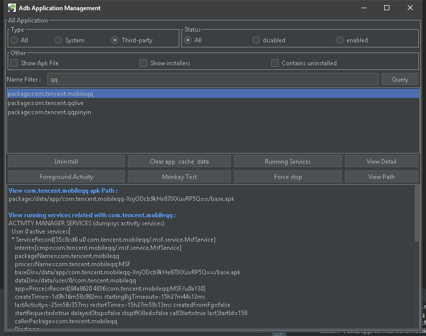

Mainly is to look at the output information, do not remember the command also it doesn't matter, don't have to lose, signing up is OK, the output of information, Ctrl + C to copy after selected, right-click can clear screen. In addition to the Foreground Activity and Monkey Test, will need to select the target APP.
#### Interacting with the application

- [start the application/tuning up the Activity](https://github.com/mzlogin/awesome-adb#%E5%90%AF%E5%8A%A8%E5%BA%94%E7%94%A8-%E8%B0%83%E8%B5%B7-activity)

  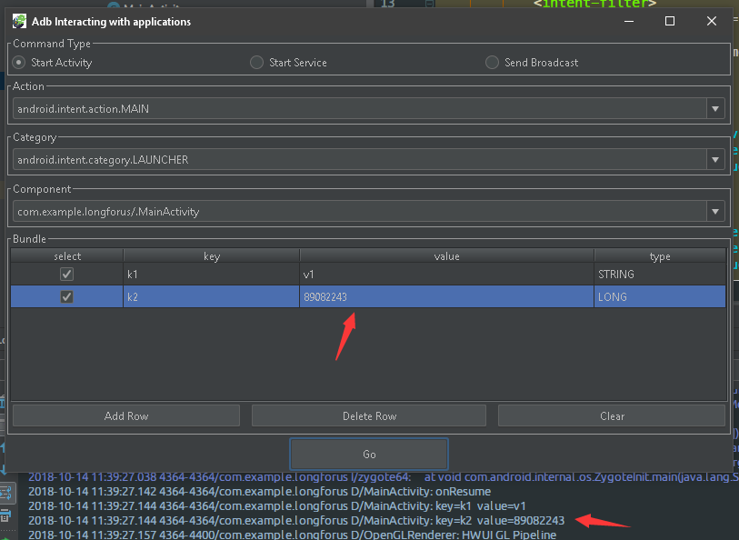

- [tuning up Service](https://github.com/mzlogin/awesome-adb#%E8%B0%83%E8%B5%B7-service)

  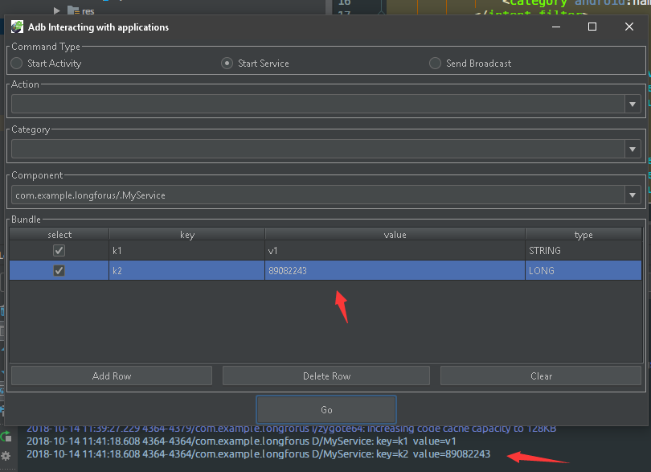

- [send broadcast](https://github.com/mzlogin/awesome-adb#%E5%8F%91%E9%80%81%E5%B9%BF%E6%92%AD)

  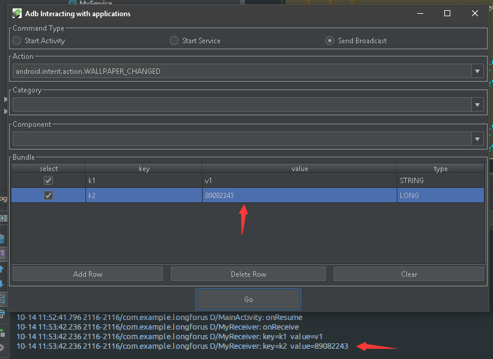

  Send the broadcast on my 8.1 real machine to prompt the security problem, cannot send normally,6.0 seems to be ok.

The above functions are integrated into: Application in Interacting.

#### View device information

- [model](https://github.com/mzlogin/awesome-adb#%E5%9E%8B%E5%8F%B7)

- [battery status](https://github.com/mzlogin/awesome-adb#%E7%94%B5%E6%B1%A0%E7%8A%B6%E5%86%B5)

- [screen resolution](https://github.com/mzlogin/awesome-adb#%E5%B1%8F%E5%B9%95%E5%88%86%E8%BE%A8%E7%8E%87)

- [screen density](https://github.com/mzlogin/awesome-adb#%E5%B1%8F%E5%B9%95%E5%AF%86%E5%BA%A6)

- [display parameters](https://github.com/mzlogin/awesome-adb#%E6%98%BE%E7%A4%BA%E5%B1%8F%E5%8F%82%E6%95%B0)

- [android_id](https://github.com/mzlogin/awesome-adb#android_id)

- [IMEI](https://github.com/mzlogin/awesome-adb#imei)

- [Android version ](https://github.com/mzlogin/awesome-adb#android-%E7%B3%BB%E7%BB%9F%E7%89%88%E6%9C%AC)

- [IP](https://github.com/mzlogin/awesome-adb#ip-%E5%9C%B0%E5%9D%80)

- [Mac](https://github.com/mzlogin/awesome-adb#mac-%E5%9C%B0%E5%9D%80)

- [CPU](https://github.com/mzlogin/awesome-adb#cpu-%E4%BF%A1%E6%81%AF)

- [Memory ](https://github.com/mzlogin/awesome-adb#%E5%86%85%E5%AD%98%E4%BF%A1%E6%81%AF)

- [more hardware and system property](https://github.com/mzlogin/awesome-adb#%E6%9B%B4%E5%A4%9A%E7%A1%AC%E4%BB%B6%E4%B8%8E%E7%B3%BB%E7%BB%9F%E5%B1%9E%E6%80%A7)

  The above functions are integrated into :Device information:

  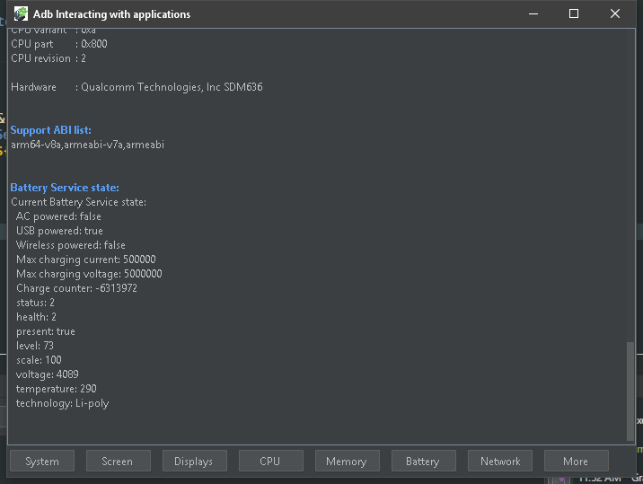

  Some information failed to get on 8.1, and the permission was rejected. Again, Ctrl+C copy and right click clear.

#### Useful features

- [insatll APK](https://github.com/mzlogin/awesome-adb#%E5%AE%89%E8%A3%85-apk)

  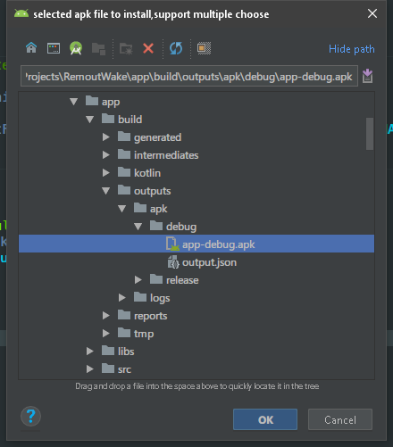

  Select the apk file and click ok to install it to the device.

- [put string](https://github.com/mzlogin/awesome-adb#%E8%BE%93%E5%85%A5%E6%96%87%E6%9C%AC)

  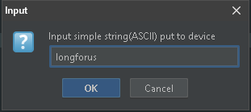

  First, make the target EditText the focus on the phone, and then ok can be pushed over. Unfortunately, Chinese characters are not supported and Spaces are removed.

- [Screenshots ](https://github.com/mzlogin/awesome-adb#%E5%B1%8F%E5%B9%95%E6%88%AA%E5%9B%BE)

  Select the folder to save to:

  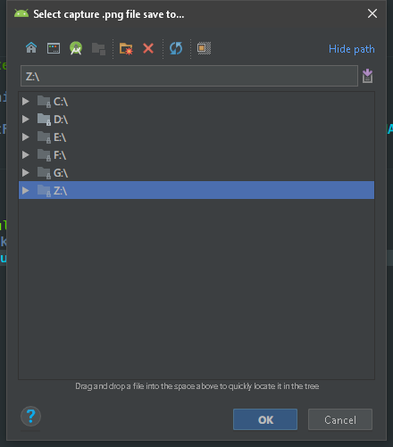

  Click OK, and the folder you saved will be opened automatically. Is that still convenient?It feels super practical.

  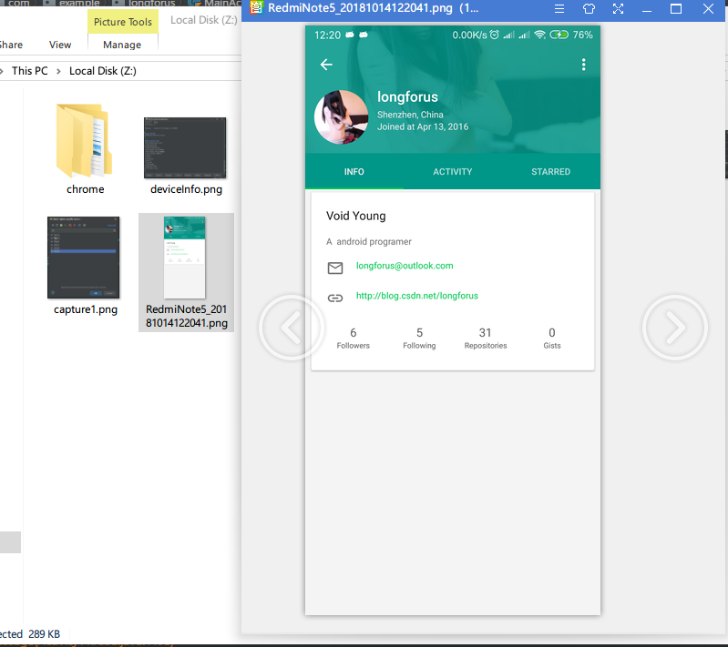

- [recording screen](https://github.com/mzlogin/awesome-adb#%E5%BD%95%E5%88%B6%E5%B1%8F%E5%B9%95)

  1. Select the folder to save to.

     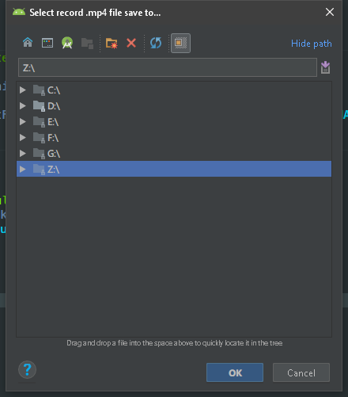

  2. Select recording time, maximum 180s:

     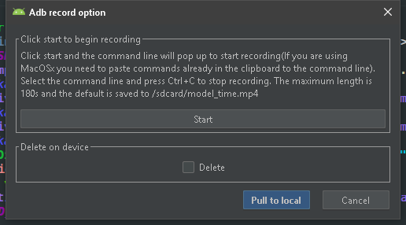

  3.  After recording, the save directory will be opened automatically:

  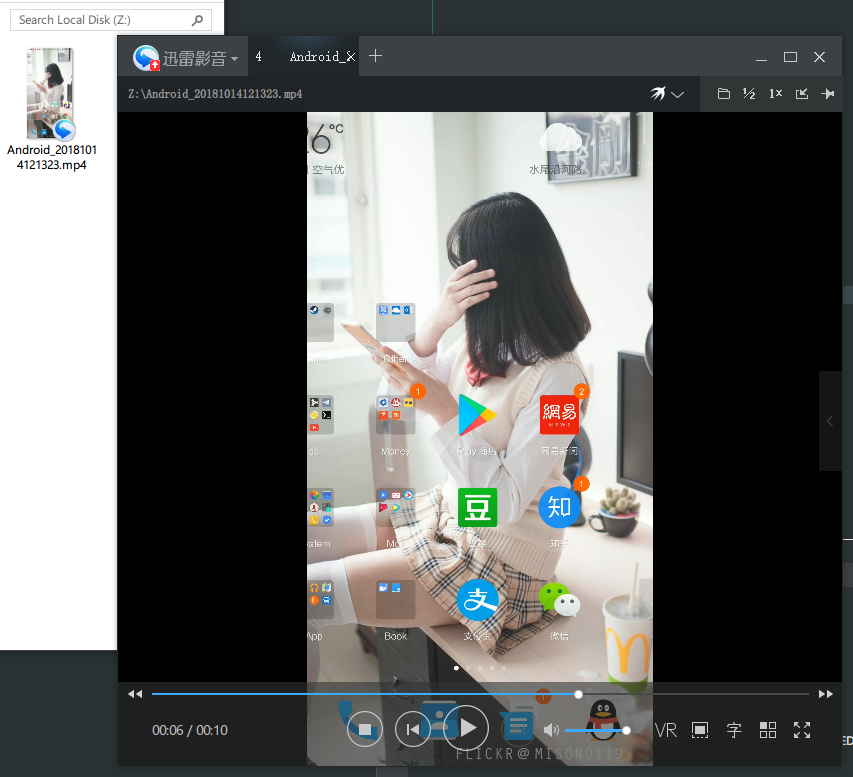

  The problem is that there is a delay of several seconds...

## download

- download[`Newly released plug-in packages`](https://github.com/longforus/adb-idea/releases/tag/1.6) > File >Preferences(Settings) > Plugins > Install plugin from disk...

## thanks

- thanks  [ADB Usage Complete / ADB 用法大全](https://github.com/mzlogin/awesome-adb) warehouse contributors to collect
- thanks [pbreault/**adb-idea**](https://github.com/pbreault/adb-idea) the excellent open source plugin

Welcome to try out,star,issue. Your star is my motivation. Thanks.