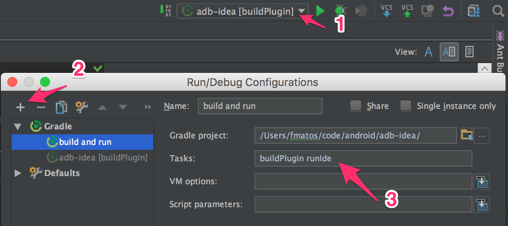

Run/Debug
=========

* Open project in Intellij
* Open _edit configurations_ to create a new run/debug configuration
* Choose a new gradle configuration and name it `build and run` that runs `./gradlew runIde`

* Hit debug button as usual

Running from command line
-------------------------
* Execute command 
```shell script
  ./gradlew runIde
```

Create new menu item
====================

* Add entry to plugin.xml inside actions tab (below line 100)
```xml
<action id="com.developerphil.adbidea.action.NewAction"
        class="com.developerphil.adbidea.action.NewAction"
        text="New Action"
        description="Playing with the plugin">
</action>
```

* Create and implement a new `NewAction` class that extends from `AdbAction` (you can create that from the plugin view, right click on the class name and choose `create class`
* Implement its abstract methods
* Add new entry in `QuickListAction.kt` like this
```kotlin
addAction("com.developerphil.adbidea.action.NewAction", group)
```