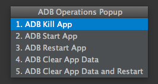
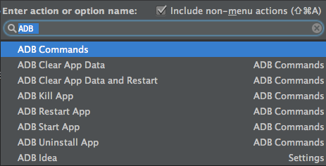
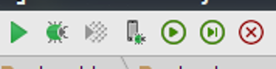

ADB Tools
=========

A plugin for Android Studio and Intellij IDEA that speeds up your day to day android development. (Fork from adb-idea)

The following commands are provided:

* Uninstall App
* Kill App
* Start App
* Restart App
* Clear App Data
* Clear App Data and Restart
* Start App With Debugger
* Restart App With Debugger
* Clear App Data and Restart With Debugger
* Reboot device

Also included are three toolbar icon shortcuts:
* Start App
* Start App With Debugger
* Kill App

Usage
=====

Quick Operations Popup
----------------------
The number on the left is a shortcut that will stay the same for your muscle memory pleasure.

* Mac OSX: Ctrl+Shift+A
* Windows/Linux: Ctrl+Alt+Shift+A

Find Actions
-----------------
Each command is prefixed by "ADB", so you can quickly filter through adb commands using the "[Find Actions](http://www.jetbrains.com/idea/webhelp/navigating-to-action.html)" shortcut.

The Menu Way
------------
You can find every command in the following top level menu: `ADB Tools`

The Toolbar Way
---------------
You can find icon shortcuts in the toolbar besides the run and debug icons:

Installation
========

Download and install *ADB Tools* directly from Intellij / Android Studio:
`Preferences/Settings->Install plugin from disk` 

License
=======

    Copyright 2014 Philippe Breault
    Copyright 2014-2015 Benoit Touchette

    Licensed under the Apache License, Version 2.0 (the "License");
    you may not use this file except in compliance with the License.
    You may obtain a copy of the License at

       http://www.apache.org/licenses/LICENSE-2.0

    Unless required by applicable law or agreed to in writing, software
    distributed under the License is distributed on an "AS IS" BASIS,
    WITHOUT WARRANTIES OR CONDITIONS OF ANY KIND, either express or implied.
    See the License for the specific language governing permissions and
    limitations under the License.
